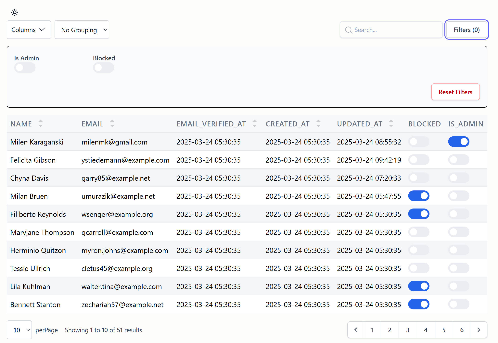
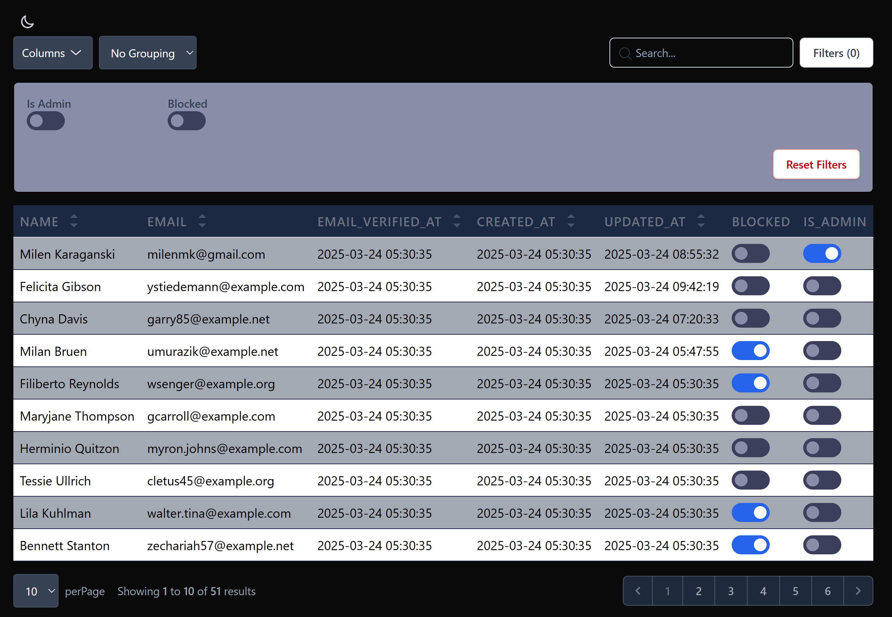

# Laravel Simple Datatables

A lightweight, easy-to-use Laravel package for creating interactive data tables with sorting, filtering, searching, and
exporting capabilities.




## Features

- 🔍 Advanced search with debouncing and minimum character requirements
- 🔄 Column sorting
- 🧹 Filtering with multiple filter types
- 📊 Data grouping
- 📱 Responsive design
- 🎨 Customizable appearance
- 📤 Export to CSV, Excel, and PDF
- 🔒 Security features
- ⚡ Performance optimizations with caching
- 🧩 Livewire integration

## Requirements

- PHP 8.2 or higher (compatible with PHP 8.3 and 8.4)
- Laravel 10.x or higher (compatible with Laravel 11.x and 12.x)
- Livewire 3.x or higher

### Version Compatibility

| Laravel Simple Datatables | PHP                  | Laravel                 | Livewire |
| ------------------------- | -------------------- | ----------------------- | -------- |
| 1.x                       | ^8.2                 | ^10.0                   | ^3.0     |
| 1.7+                      | ^8.2 \| ^8.3 \| ^8.4 | ^10.0 \| ^11.0 \| ^12.0 | ^3.0     |
| 1.8+                      | ^8.2 \| ^8.3 \| ^8.4 | ^10.0 \| ^11.0 \| ^12.0 | ^3.0     |
| 1.9+                      | ^8.2 \| ^8.3 \| ^8.4 | ^10.0 \| ^11.0 \| ^12.0 | ^3.0     |

## Installation

You can install the package via composer:

```
composer require milenmk/laravel-simple-datatables
```

## Publishing Assets

Publish the package assets:

```
php artisan simple-datatables:publish-assets
```

Optionally, you can publish the configuration file:

```
php artisan vendor:publish --tag=laravel-simple-datatables-config
```

## Including Assets

Add the following directives to your layout file:

```blade
<head>
    <!-- Other head elements -->
    @SimpleDatatablesStyle
</head>

<body>
    <!-- Your content -->

    <!-- Scripts -->
    @SimpleDatatablesScript
</body>
```

### Tailwind CSS Integration

As an alternative to the assets publishing command, you can copy the content from
`/vendor/milenmk/laravel-simple-datatables/resources/css/package.css` to your `app.css` file. Then:

### For Tailwind CSS

Add the package views to your Tailwind configuration:

```js
// tailwind.config.js
module.exports = {
    content: [
        // ... your existing content paths
        './vendor/milenmk/laravel-simple-datatables/resources/views/**/*.blade.php',
    ],
    // ... rest of your configuration
};
```

### Editing assets

If you want to edit the view files, run:

```
php artisan vendor:publish --tag="laravel-simple-datatables-views"
```

The view files are now available in `/resources/views/vendor/laravel-simple-datatables`

To make the classes in the package view files discovered when running `npm run dev` or `npm run build`, add the
published views path to your Tailwind configuration:

```js
// tailwind.config.js
module.exports = {
    content: [
        // ... your existing content paths
        './resources/views/vendor/laravel-simple-datatables/**/*.blade.php',
    ],
    // ... rest of your configuration
};
```

## Usage

### Using a command

1. Run `php artisan make:milenmk-datatable PostList Post` where `PostList` is the name of the Livewire component that
   will be created and `Post` is the name of the model.

2. If you want to generate the columns for the model properties you add `--generate` at the end of the command

3. The command will create a component in `App\Livewire` and a view file in `resources/views/livewire`

### Manual

1. In you Livewire component add the package trait `use HasTable;`
2. Define your table fields like:

```
public function table(Table $table): Table
    {
        return $table
            ->query(Menu::query())
            ->schema([
                TextColumn::make('name')
                    ->label('Name')
                    ->searchable()
                    ->sortable(),
                TextColumn::make('route_name')
                    ->label('Route')
                    ->sortable(),
                TextColumn::make('parent_menu_id')->label('Parent ID'),
                TextColumn::make('type')->label('Type'),
                TextColumn::make('icon')->label('Icon'),
                TextColumn::make('position')
                    ->label('Position')
                    ->align('center')
                    ->headerAlign('center'),
                ToggleColumn::make('is_admin_menu')->label('Is Admin Menu'),
                IconColumn::make('is_admin_menu')->boolean(),
            ])
            ->striped();
    }
```

3. In the view file of the Livewire component add `{{ $this->table }}` to render the table

## Advanced Usage

### Adding Filters

```php
use Milenmk\LaravelSimpleDatatables\Table\Filters\SelectFilter;
use Milenmk\LaravelSimpleDatatables\Table\Filters\DateFilter;

public function table(Table $table): Table
{
    return $table
        ->query(User::query())
        ->heading('Users')
        ->striped()
        ->schema([
            // Columns...
        ])
        ->filters([
            SelectFilter::make('role')
                ->options([
                    'admin' => 'Admin',
                    'user' => 'User',
                ])
                ->label('Role'),

            DateFilter::make('created_at')
                ->label('Created Date'),
        ]);
}
```

### Grouping Data

```php
use Milenmk\LaravelSimpleDatatables\Table\Group;

public function table(Table $table): Table
{
    return $table
        ->query(User::query())
        ->heading('Users')
        ->schema([
            // Columns...
        ])
        ->groups([
            Group::make('role')
                ->label('Role'),
        ]);
}
```

### Exporting Data

The export functionality is automatically included when you use the `HasTable` trait. Users can export data to CSV,
Excel, or PDF formats.

### Available Columns

- **TextColumn**: Displays text content with optional formatting

    ```php
    TextColumn::make('name')->label('Full Name')->searchable()->sortable();
    ```

- **ToggleColumn**: Creates a toggle switch for boolean values

    ```php
    ToggleColumn::make('is_active')->label('Active Status');
    ```

- **CheckBoxColumn**: Creates a checkbox for selection

    ```php
    CheckBoxColumn::make('selected')->label('Select');
    ```

- **ProgressColumn**: Displays a progress bar

    ```php
    ProgressColumn::make('completion')->label('Progress')->min(0)->max(100)->color('primary'); // primary, success, warning, danger
    ```

- **IconColumn**: Displays an icon, useful for boolean states

    ```php
    IconColumn::make('is_verified')
        ->boolean() // Shows check or x icon based on value
        ->label('Verified');
    ```

- **ActionColumn**: Displays action buttons
    ```php
    ActionColumn::make('actions')
        ->label('Actions')
        ->actions([
            EditAction::make('edit')->label('Edit')->icon('pencil')->url(fn($row) => route('users.edit', $row)),
        ]);
    ```

### Column Options/Settings

- `label` (string|array|callable) - The column header label
- `value` (callable) - Custom value for the column
    ```php
    TextColumn::make('full_name')->value(fn($row) => $row->first_name . ' ' . $row->last_name);
    ```
- `color` (string) - Text color using Tailwind classes (e.g., text-gray-500, text-primary, text-danger)
- `background` (string) - Background color using Tailwind classes (e.g., bg-gray-500, bg-danger)
- `visible` (bool) - Whether the column is visible (default: true)
- `weight` (string) - Font weight of the text (e.g., font-bold, font-thin, font-medium)
- `wrap` (bool) - Whether text should wrap (default: true)
- `description` (string|callable) - Additional description text shown below the main content
- `align` (string) - Content alignment: 'left', 'center', 'right' (default: 'left')
- `headerAlign` (string) - Header alignment: 'left', 'center', 'right' (default: 'left')
- `model` (string) - Custom wire:model name (default is the column key)
- `searchable` (bool) - Whether the column is searchable (default: false)
- `sortable` (bool) - Whether the column is sortable (default: false)
- `format` (callable) - Format the value before display
    ```php
    TextColumn::make('created_at')->format(fn($value) => $value->format('Y-m-d H:i'));
    ```
- `tooltip` (string|callable) - Add a tooltip to the column
- `hidden` (bool) - Hide the column but keep it available for export (default: false)
- `exportOnly` (bool) - Only include this column in exports (default: false)

    #### Icon Column options

    ```php
    //Change both default color and icon
    IconColumn::make('status')
        ->boolean()
        ->label('Status')
        ->true('icon', 'color')
        ->false('icon', 'color')

    // Change only the icon
    IconColumn::make('status')
        ->boolean()
        ->label('Status')
        ->trueIcon('icon')
        ->falseIcon('icon')

    // Change only the color
    IconColumn::make('status')
        ->boolean()
        ->label('Status')
        ->trueColor('color')
        ->falseColor('color')
    ```

    #### Action Column options

    ```php
    // To group the action in a dropdown use groupActions()
    ActionColumn::make('actions')->groupActions();
    ```

## DISCLAIMER

This package is provided ”as is”, without warranty of any kind, either express or implied, including but not limited to
the warranties of merchantability, fitness for a particular
purpose, or noninfringement.

The author(s) make no representations or warranties regarding the accuracy, reliability or completeness of the code or
its suitability for any specific use case. It is recommended
that you thoroughly test this package in your environment before deploying it to production.

By using this package, you acknowledge and agree that the author(s) shall not be held liable for any damages, losses or
other issues arising from the use of this software.

## Contributing

You can review the source code, report bugs, or contribute to the project by visiting the GitHub repository:

[GitHub Repository](https://github.com/milenmk/laravel-simple-datatables)

Feel free to open issues or submit pull requests. Contributions are welcome!

## Documentation

- [Configuration](docs/configuration.md)
- [Search](docs/search.md)
- [Export](docs/export.md)
- [Caching](docs/caching.md)
- [Pagination](docs/pagination.md)

## License

This package is licensed under the MIT License. See the [LICENSE](LICENSE) file for more details.
