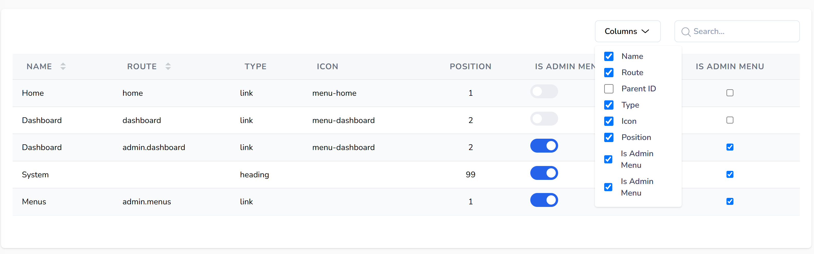

## About

This package provides simple Table component to create Datatables for Livewire components



## Requirements

- PHP 8.2 or higher
- Laravel 10.x or higher
- Livewire 3.x or higher

## Install

Run ```composer require milenmk/laravel-simple-datatables``` to install the package

Add `@SimpleDatatablesStyle` in the `head` tag of your layout to include the package css

If you want to edit the view files, then run `php artisan vendor:publish --tag="laravel-simple-datatables-views"`

The view files are now available in `/resources/views/vendor/laravel-simple-datatables`

## Tailwind CSS

To make the classes in the package view files discovered when running `npm run dev` оr `npm run build`, add:

### For Tailwind 4.x

Add `@source '../../vendor/milenmk/laravel-simple-datatables/resources/views/';` in your app.css

### For Tailwind 3.x

Add `'../../vendor/milenmk/laravel-simple-datatables/resources/views/'` inside `content: []` of `tailwind.config.js`

## Usage

### Using a command

1. Run `php artisan make:milenmk-datatable PostList Post` where `PostList` is the name of the Livewire component that
   will be created and `Post` is the name of the model.

2. If you want to generate the columns for the model properties you add `--generate` at the end of the command

3. The command will create a component in `App\Livewire` and a view file in `resources/views/livewire`

### Manual

1. In you Livewire component add the package trait `use HasTable;`
2. Define your table fields like:

```
public function table(Table $table): Table
    {
        return $table
            ->query(Menu::query())
            ->schema([
                TextColumn::make('name')
                    ->label('Name')
                    ->searchable()
                    ->sortable(),
                TextColumn::make('route_name')
                    ->label('Route')
                    ->sortable(),
                TextColumn::make('parent_menu_id')->label('Parent ID'),
                TextColumn::make('type')->label('Type'),
                TextColumn::make('icon')->label('Icon'),
                TextColumn::make('position')
                    ->label('Position')
                    ->align('center')
                    ->headerAlign('center'),
                ToggleColumn::make('is_admin_menu')->label('Is Admin Menu'),
                IconColumn::make('is_admin_menu')->boolean(),
            ])
            ->striped();
    }
```

3. In the view file of the Livewire component add `{{ $this->table }}` to render the table

## Additional Information

- Available columns: TextColumn, ToggleColumn, CheckBoxColumn, ProgressColumn and IconColumn
- Available column options/settings:
    - label (string|array|callable)
    - value
    - color (Full value e.g. text-gray-500, text-primary, text-danger etc.)
    - background (Full value e.g. bg-gray-500, bg-danger)
    - visible (true|false, default true)
    - weight (font weight of the text (e.g., bold, thin, medium))
    - wrap (true|false, default true)
    - description (string|callable)
    - align (left|center|right, default left)
    - model (Specify custom value for the wire:model of the field. Default is the column key inside make())

## DISCLAIMER

This package is provided ”as is”, without warranty of any kind, either express or implied, including but not limited to
the warranties of merchantability, fitness for a particular
purpose, or noninfringement.

The author(s) make no representations or warranties regarding the accuracy, reliability or completeness of the code or
its suitability for any specific use case. It is recommended
that you thoroughly test this package in your environment before deploying it to production.

By using this package, you acknowledge and agree that the author(s) shall not be held liable for any damages, losses or
other issues arising from the use of this software.

## Contributing

You can review the source code, report bugs, or contribute to the project by visiting the GitHub repository:

[GitHub Repository](https://github.com/milenmk/laravel-simple-datatables)

Feel free to open issues or submit pull requests. Contributions are welcome!

## License

This package is licensed under the MIT License. See the [LICENSE](LICENSE) file for more details.
